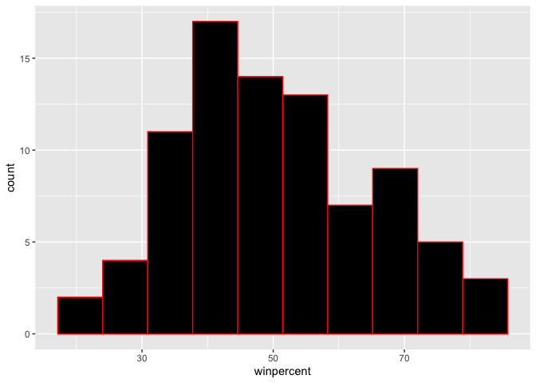
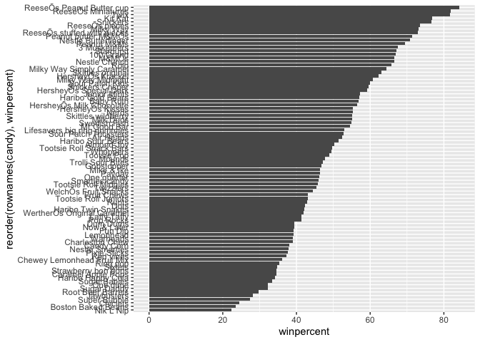
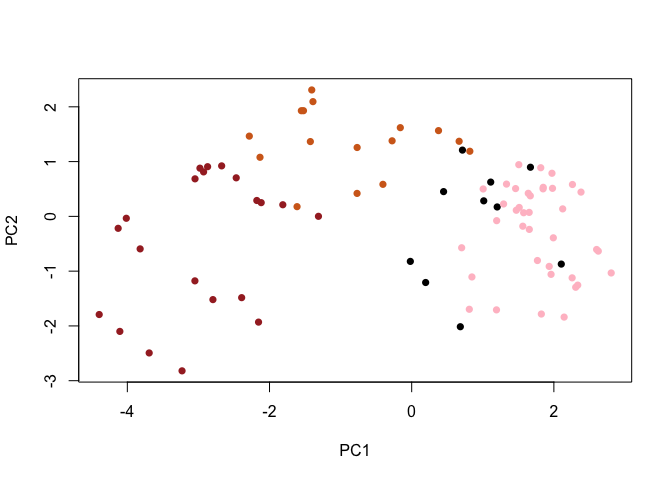

Class 10: Halloween Candy Mini Project
================
Garrett Cole

## Import Data

``` r
candy_file <- "candy-data.csv"

candy = read.csv(candy_file, row.names=1)
head(candy)
```

                 chocolate fruity caramel peanutyalmondy nougat crispedricewafer
    100 Grand            1      0       1              0      0                1
    3 Musketeers         1      0       0              0      1                0
    One dime             0      0       0              0      0                0
    One quarter          0      0       0              0      0                0
    Air Heads            0      1       0              0      0                0
    Almond Joy           1      0       0              1      0                0
                 hard bar pluribus sugarpercent pricepercent winpercent
    100 Grand       0   1        0        0.732        0.860   66.97173
    3 Musketeers    0   1        0        0.604        0.511   67.60294
    One dime        0   0        0        0.011        0.116   32.26109
    One quarter     0   0        0        0.011        0.511   46.11650
    Air Heads       0   0        0        0.906        0.511   52.34146
    Almond Joy      0   1        0        0.465        0.767   50.34755

# Question 1: How many different candy types are in the dataset?

85

``` r
nrow(candy)
```

    [1] 85

# Question 2: How many fruit candy types are in the dataset?

38

``` r
sum(candy$fruity)
```

    [1] 38

# Question 3: What is your facvorite candy in the dataset and what is it’s winpercent value?

My favorite candy is Swedish Fish and it’s winpercent value is 54.86111

``` r
candy["Swedish Fish", ]$winpercent
```

    [1] 54.86111

# Question 4: What is the winpercent value for Kit Kat?

76.7686

``` r
candy["Kit Kat",]$winpercent
```

    [1] 76.7686

# Question 5: What is the winpercent value for Tootsie Roll Snack Bars?

49.6535

``` r
candy["Tootsie Roll Snack Bars",]$winpercent
```

    [1] 49.6535

## Skim Function

``` r
library("skimr")
skim(candy)
```

|                                                  |       |
|:-------------------------------------------------|:------|
| Name                                             | candy |
| Number of rows                                   | 85    |
| Number of columns                                | 12    |
| \_\_\_\_\_\_\_\_\_\_\_\_\_\_\_\_\_\_\_\_\_\_\_   |       |
| Column type frequency:                           |       |
| numeric                                          | 12    |
| \_\_\_\_\_\_\_\_\_\_\_\_\_\_\_\_\_\_\_\_\_\_\_\_ |       |
| Group variables                                  | None  |

Data summary

**Variable type: numeric**

| skim_variable    | n_missing | complete_rate |  mean |    sd |    p0 |   p25 |   p50 |   p75 |  p100 | hist  |
|:-----------------|----------:|--------------:|------:|------:|------:|------:|------:|------:|------:|:------|
| chocolate        |         0 |             1 |  0.44 |  0.50 |  0.00 |  0.00 |  0.00 |  1.00 |  1.00 | ▇▁▁▁▆ |
| fruity           |         0 |             1 |  0.45 |  0.50 |  0.00 |  0.00 |  0.00 |  1.00 |  1.00 | ▇▁▁▁▆ |
| caramel          |         0 |             1 |  0.16 |  0.37 |  0.00 |  0.00 |  0.00 |  0.00 |  1.00 | ▇▁▁▁▂ |
| peanutyalmondy   |         0 |             1 |  0.16 |  0.37 |  0.00 |  0.00 |  0.00 |  0.00 |  1.00 | ▇▁▁▁▂ |
| nougat           |         0 |             1 |  0.08 |  0.28 |  0.00 |  0.00 |  0.00 |  0.00 |  1.00 | ▇▁▁▁▁ |
| crispedricewafer |         0 |             1 |  0.08 |  0.28 |  0.00 |  0.00 |  0.00 |  0.00 |  1.00 | ▇▁▁▁▁ |
| hard             |         0 |             1 |  0.18 |  0.38 |  0.00 |  0.00 |  0.00 |  0.00 |  1.00 | ▇▁▁▁▂ |
| bar              |         0 |             1 |  0.25 |  0.43 |  0.00 |  0.00 |  0.00 |  0.00 |  1.00 | ▇▁▁▁▂ |
| pluribus         |         0 |             1 |  0.52 |  0.50 |  0.00 |  0.00 |  1.00 |  1.00 |  1.00 | ▇▁▁▁▇ |
| sugarpercent     |         0 |             1 |  0.48 |  0.28 |  0.01 |  0.22 |  0.47 |  0.73 |  0.99 | ▇▇▇▇▆ |
| pricepercent     |         0 |             1 |  0.47 |  0.29 |  0.01 |  0.26 |  0.47 |  0.65 |  0.98 | ▇▇▇▇▆ |
| winpercent       |         0 |             1 | 50.32 | 14.71 | 22.45 | 39.14 | 47.83 | 59.86 | 84.18 | ▃▇▆▅▂ |

# Question 6: Is there any variable/column that looks to be on a different scale to the majority of the other columns in the dataset?

Yes, the variable winpercent for mean, sd, p0, p25, p50, p75, and p100
is on much larger scale than the other variables in the dataset

# Question 7: What do you think a zero and one represent for the candy\$chocolate column?

I think a one represents that candy variable is a chocolate candy while
a zero represents that candy variable is not a chocolate candy

# Question 8: Plot a histogram of winpercent values

``` r
library(ggplot2)

ggplot(candy) +
  aes(winpercent) +
  geom_histogram(bins = 10, col="red", fill="black")
```



# Question 9: Is the distribution of winpercent values symmetrical?

No

# Question 10: Is the center of the distribution above or below 50%?

Below

# Question 11: On average is chocolate candy higher or lower ranked than fruit candy?

``` r
# Chocolate Average Rank
chocolate.inds <- as.logical(candy$chocolate)
chocolate.wins <- candy[chocolate.inds,]$winpercent
mean(chocolate.wins)
```

    [1] 60.92153

``` r
#Fruit Average Rank
fruit.inds <- as.logical(candy$fruity)
fruit.wins <- candy[fruit.inds,]$winpercent
mean(fruit.wins)
```

    [1] 44.11974

On average, chocolate candy is higher ranked than fruit candy

# Question 12: Is this difference statistically significant?

``` r
t.test(chocolate.wins, fruit.wins)
```


        Welch Two Sample t-test

    data:  chocolate.wins and fruit.wins
    t = 6.2582, df = 68.882, p-value = 2.871e-08
    alternative hypothesis: true difference in means is not equal to 0
    95 percent confidence interval:
     11.44563 22.15795
    sample estimates:
    mean of x mean of y 
     60.92153  44.11974 

The difference is statistically significant

# Overall Candy Rankings

``` r
# 5 least liked
head(candy[order(candy$winpercent),], n=5)
```

                       chocolate fruity caramel peanutyalmondy nougat
    Nik L Nip                  0      1       0              0      0
    Boston Baked Beans         0      0       0              1      0
    Chiclets                   0      1       0              0      0
    Super Bubble               0      1       0              0      0
    Jawbusters                 0      1       0              0      0
                       crispedricewafer hard bar pluribus sugarpercent pricepercent
    Nik L Nip                         0    0   0        1        0.197        0.976
    Boston Baked Beans                0    0   0        1        0.313        0.511
    Chiclets                          0    0   0        1        0.046        0.325
    Super Bubble                      0    0   0        0        0.162        0.116
    Jawbusters                        0    1   0        1        0.093        0.511
                       winpercent
    Nik L Nip            22.44534
    Boston Baked Beans   23.41782
    Chiclets             24.52499
    Super Bubble         27.30386
    Jawbusters           28.12744

``` r
# 5 most liked
tail(candy[order(candy$winpercent),], n=5)
```

                              chocolate fruity caramel peanutyalmondy nougat
    Snickers                          1      0       1              1      1
    Kit Kat                           1      0       0              0      0
    Twix                              1      0       1              0      0
    ReeseÕs Miniatures                1      0       0              1      0
    ReeseÕs Peanut Butter cup         1      0       0              1      0
                              crispedricewafer hard bar pluribus sugarpercent
    Snickers                                 0    0   1        0        0.546
    Kit Kat                                  1    0   1        0        0.313
    Twix                                     1    0   1        0        0.546
    ReeseÕs Miniatures                       0    0   0        0        0.034
    ReeseÕs Peanut Butter cup                0    0   0        0        0.720
                              pricepercent winpercent
    Snickers                         0.651   76.67378
    Kit Kat                          0.511   76.76860
    Twix                             0.906   81.64291
    ReeseÕs Miniatures               0.279   81.86626
    ReeseÕs Peanut Butter cup        0.651   84.18029

## Question 13: What are the five least liked candy types in this set?

Nik L Nip, Boston Baked Beans, Chiclets, Super Bubble, Jawbusters

## Question 14: What are the top 5 all time favorite candy types out of this set?

Snickers, Kit Kat, Twix, Reese’s Miniatures, Reese’s Peanut Butter Cup

## Question 15: Make a first barplot of candy ranking based on winpercent values.

``` r
library(ggplot2)

ggplot(candy)+
  aes(winpercent, rownames(candy)) +
  geom_col()
```


## Question 16: This is quite ugly, use the reorder() function to get the bars sorted by winpercent?

``` r
library(ggplot2)

ggplot(candy)+
  aes(winpercent, reorder(rownames(candy),winpercent)) +
  geom_col()
```



``` r
#Set color for each candy type
my_cols=rep("black", nrow(candy))
my_cols[as.logical(candy$chocolate)] = "chocolate"
my_cols[as.logical(candy$bar)] = "brown"
my_cols[as.logical(candy$fruity)] = "pink"
```

``` r
library(ggplot2)

ggplot(candy) + 
  aes(winpercent, reorder(rownames(candy),winpercent)) +
  geom_col(fill=my_cols) 
```


## Question 17: What is the worst ranked candy?

Nik L Nip

## Question 18: What is the best ranked candy?

Reeses Peanut Butter Cup

# Taking a Look at Pricepercent

``` r
library(ggrepel)

# How about a plot of price vs win
ggplot(candy) +
  aes(winpercent, pricepercent, label=rownames(candy)) +
  geom_point(col=my_cols) + 
  geom_text_repel(col=my_cols, size=3.3, max.overlaps = 50)
```


## Question 19: Which candy type is the highest ranked in terms of winpercent for the least money - i.e. offers the most bang for your buck?

Reeses Miniatures

## Question 20: What are the top 5 most expensive candy types in the dataset and of these which is the least popular?

The top 5 most expensive candy types are Nik L Nip, Nestle Smarties,
Hershey’s Krackel, Hershey’s Milk Chocolate, and Mr Good Bar. The least
popular is Nik L Nip

## Question 21: Make a barplot again with geom_col() this time using pricepercent and then improve this step by step, first ordering the x-axis by value and finally making a so called “dot chat” or “lollipop” chart by swapping geom_col() for geom_point() + geom_segment().

``` r
ggplot(candy) +
  aes(pricepercent, reorder(rownames(candy), pricepercent)) +
  geom_segment(aes(yend = reorder(rownames(candy), pricepercent), 
                   xend = 0), col="gray40") +
    geom_point()
```


# Exploring the correlation structure

``` r
library(corrplot)
```

    corrplot 0.92 loaded

``` r
cij <- cor(candy)
corrplot(cij)
```


## Question 22: Examining this plot what two variables are anti-correlated (i.e. have minus values)?

Fruity & Chocolate

## Question 23: Similarly, what two variables are most positively correlated?

Win Percent & Chocolate

# Principal Component Analysis

``` r
pca <- prcomp(candy, scale = TRUE)
summary(pca)
```

    Importance of components:
                              PC1    PC2    PC3     PC4    PC5     PC6     PC7
    Standard deviation     2.0788 1.1378 1.1092 1.07533 0.9518 0.81923 0.81530
    Proportion of Variance 0.3601 0.1079 0.1025 0.09636 0.0755 0.05593 0.05539
    Cumulative Proportion  0.3601 0.4680 0.5705 0.66688 0.7424 0.79830 0.85369
                               PC8     PC9    PC10    PC11    PC12
    Standard deviation     0.74530 0.67824 0.62349 0.43974 0.39760
    Proportion of Variance 0.04629 0.03833 0.03239 0.01611 0.01317
    Cumulative Proportion  0.89998 0.93832 0.97071 0.98683 1.00000

``` r
#Main PCA score plot of PC1 vs. PC2
plot(pca$x[,1:2], col=my_cols, pch = 16)
```



``` r
#Make a new data-frame with our PCA results and candy data
my_data <- cbind(candy, pca$x[,1:3])

p <- ggplot(my_data) + 
        aes(x=PC1, y=PC2, 
            size=winpercent/100,  
            text=rownames(my_data),
            label=rownames(my_data)) +
        geom_point(col=my_cols)

p
```


``` r
library(ggrepel)

p + geom_text_repel(size=3.3, col=my_cols, max.overlaps = 10)  + 
  theme(legend.position = "none") +
  labs(title="Halloween Candy PCA Space",
       subtitle="Colored by type: chocolate bar (dark brown), chocolate other (light brown), fruity (red), other (black)",
       caption="Data from 538")
```

    Warning: ggrepel: 20 unlabeled data points (too many overlaps). Consider
    increasing max.overlaps


## Question 24: What original variables are picked up strongly by PC1 in the positive direction? Do these make sense to you

The original variables picked up strongly by PC1 in the positive
direction are fruity. This makes sense to be because fruity and
chocolate are anti-correlated and since chocolate is high negative value
then fruity would be a high positive value.
